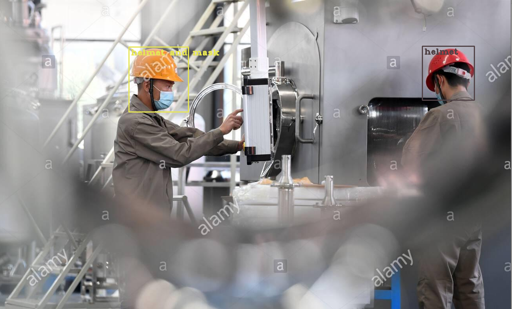

# Helment and Mask Detection

I have used Yolov3 as an object detection model to train 4 classes - 

* head,
* helmet and mask,
* mask,
* helmet

I have chosen yolo, because it is quite fast on par with mobilenet-SSD, 
gives a median accuracy with less data and training time.

#### Dependencies - refer requirement.txt
* cycler==0.10.0
* kiwisolver==1.2.0
* matplotlib==3.2.1
* numpy==1.18.4
* opencv-python==4.2.0.34
* pandas==1.0.3
* pyparsing==2.4.7
* python-dateutil==2.8.1
* pytz==2020.1
* six==1.15.0

### Model Params
 * batch=64
 * width=416
 * height=416
 * channels=3 
 * momentum=0.9
 * decay=0.0005
 * learning_rate=0.001
 * classes=4

#### Inference
* To Run Inference: python3 inference.py --image images/0.jpg --config yolov3-helmet.cfg --weights ../backup/yolov3-helmet_20000.weights --names data.names

